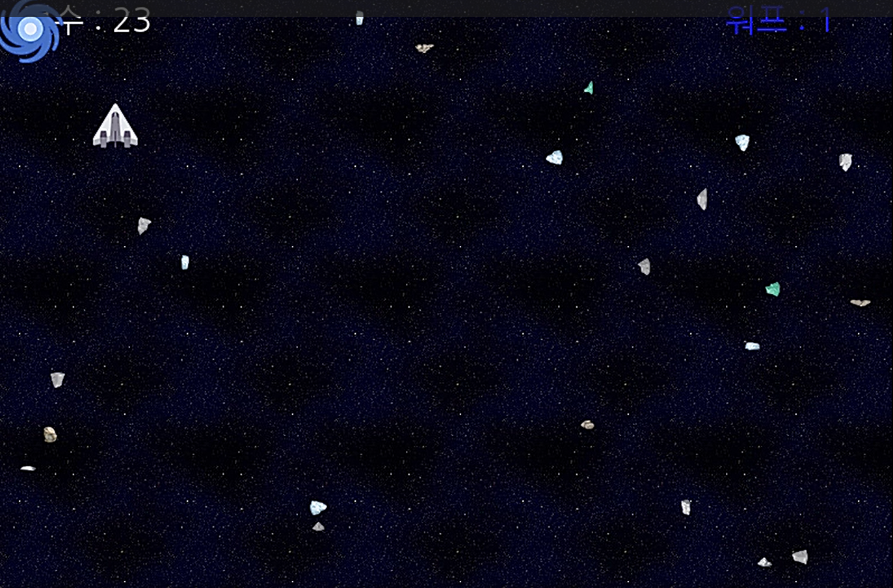

# PySpaceShip
### Avoid Rocks!!

## 프로젝트 요약
 
> 2023.10.28 - 2023.10.30
 
> **Python 개인 프로젝트**
* 우주선(플레이어)의 마우스 모션을 이용하여 암석을 피하는 게임
* 포토샵으로 게임 배경 제작, 우주선 및 암석은 기존의 슈팅 게임의 리소스를 참조하여 사용
* PyGame Package를 활용하여 제작하였습니다.
 

> **게임 설명**
* 파이참의 파이게임 라이브러리 설치(pygame 2.5.2)
* 화면창의 크기:800 * 600
* 게임 배경 색은 BLACK, WHITE, YELLOW, BLACK, BLUE 이렇게 RGB 설정
* 게임 1프레임당 60초의 간격을 주었음
* 우주선, 운석, 워프 클래스 생성
* 우주선은 화면 창에서 벗어나지 않도록 설정, 운석에 부딪히면 즉시 종료
* 운석은 x,y축의 랜덤한 방향으로 사방으로 등장
* 게임에 워프가 존재하여 마우스 아래쪽을 클릭하는 즉시 랜덤하게 등장하는 암석이 다시 사라지고 게임의 처음 상태로 돌아감
* 파괴 음악, 배경음악의 효과음 설
 

> **게임 설명**

## 시연영상
https://www.youtube.com/watch?v=yIvdFoJGK4U
